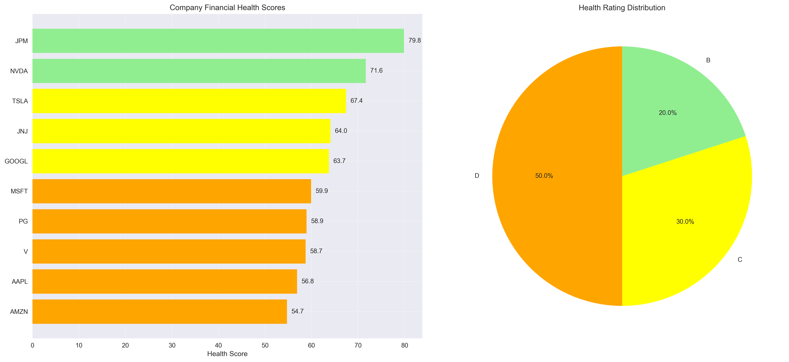
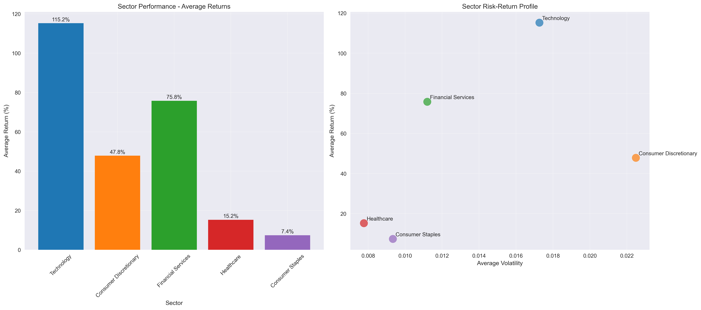
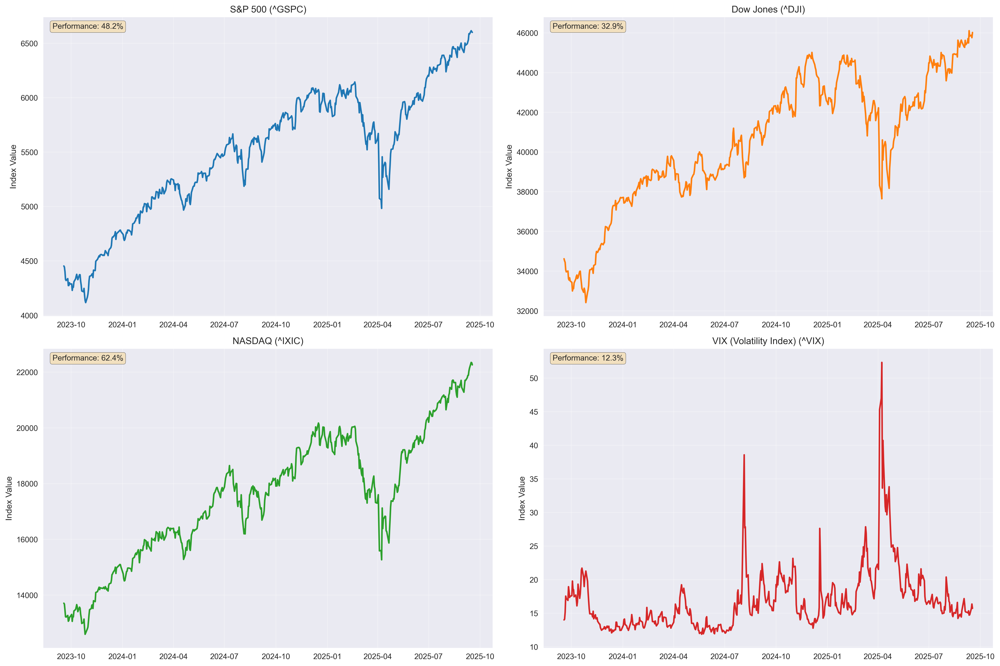
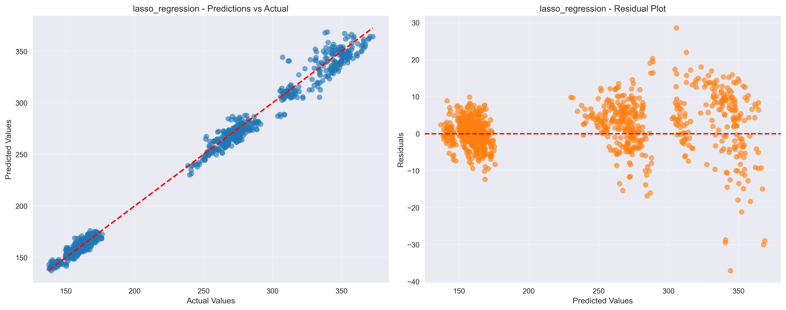
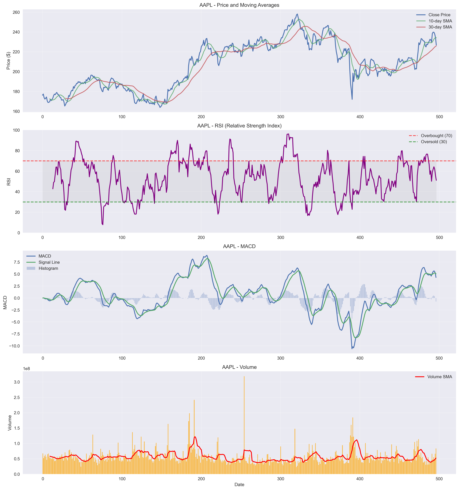

# Financial Market Analysis & ML Prediction System

A practical financial analysis system that analyzes real company data to predict stock prices and generate investment insights. Built to demonstrate machine learning applications in finance and economic analysis.

## Project Overview

This project was built to explore how machine learning can be applied to financial markets. The system includes:

- **Real-time Data Extraction**: Live stock data from Yahoo Finance API
- **Company Financial Analysis**: Health scoring, sector comparison, risk assessment
- **Machine Learning Predictions**: Stock price forecasting and direction prediction
- **Economic Analysis**: Market correlation, portfolio optimization, anomaly detection
- **Professional Visualizations**: Interactive dashboards and financial charts
- **Investment Recommendations**: Data-driven investment insights

## Companies Analyzed

**Technology Sector:**
- Apple Inc. (AAPL)
- Microsoft Corporation (MSFT)
- Alphabet Inc. (GOOGL)
- NVIDIA Corporation (NVDA)

**Financial Services:**
- JPMorgan Chase & Co. (JPM)
- Visa Inc. (V)

**Consumer & Healthcare:**
- Amazon.com Inc. (AMZN)
- Tesla Inc. (TSLA)
- Procter & Gamble (PG)
- Johnson & Johnson (JNJ)

## Economic Indicators Tracked

- S&P 500 Index
- Dow Jones Industrial Average
- NASDAQ Composite
- VIX (Volatility Index)

## Machine Learning Models

### Price Prediction (Regression):
- Linear Regression
- Ridge & Lasso Regression
- Random Forest
- Gradient Boosting
- Support Vector Regression
- Neural Networks

### Direction Prediction (Classification):
- Logistic Regression
- Random Forest Classifier
- Gradient Boosting Classifier
- Support Vector Machine
- Neural Network Classifier

## Financial Features Extracted

### Technical Indicators:
- Simple Moving Averages (SMA 10, 30)
- Exponential Moving Averages (EMA 12, 26)
- MACD (Moving Average Convergence Divergence)
- RSI (Relative Strength Index)
- Bollinger Bands
- Volume Analysis

### Fundamental Data:
- Market Capitalization
- P/E Ratio, P/B Ratio, PEG Ratio
- Revenue, EBITDA, Net Income
- Debt-to-Equity Ratio
- Cash Flow Metrics
- Beta (Market Risk)

## Economic Analysis Features

### 1. Financial Health Scoring
- Comprehensive scoring algorithm (0-100)
- Letter grades (A-F rating system)
- Multi-factor analysis including profitability, liquidity, growth

### 2. Sector Performance Analysis
- Cross-sector comparison
- Risk-return profiles
- Correlation analysis

### 3. Risk Assessment
- Market risk (Beta calculation)
- Volatility analysis
- Technical risk indicators
- Financial leverage assessment

### 4. Portfolio Optimization
- Correlation matrix analysis
- Sharpe ratio calculation
- Risk-return optimization

### 5. Anomaly Detection
- Market anomaly identification
- Unusual trading pattern detection
- Statistical outlier analysis

## Quick Start

### Installation

```bash
# Clone the repository
git clone <your-repo-url>
cd project-paper-pitch

# Install dependencies
pip install -r requirements.txt
```

### Run Complete Analysis

```bash
# Run full financial ML pipeline
python financial_ml_pipeline.py

# Run real-time prediction demo
python financial_ml_pipeline.py --demo
```

### Explore with Jupyter

```bash
# Start Jupyter notebook
jupyter notebook notebooks/financial_analysis_demo.ipynb
```

## Sample Outputs

### Financial Health Scores
```
TOP FINANCIAL HEALTH PICKS:
  AAPL (Apple Inc.): 87.3/100 - Rating A
  MSFT (Microsoft Corporation): 84.1/100 - Rating A
  GOOGL (Alphabet Inc.): 81.7/100 - Rating A
```

### Model Performance
```
PRICE PREDICTION MODELS:
  Random Forest: R² = 0.834
  Gradient Boosting: R² = 0.821
  Neural Network: R² = 0.798

DIRECTION PREDICTION MODELS:
  Random Forest: Accuracy = 0.687
  Gradient Boosting: Accuracy = 0.673
```

### Investment Recommendations
```
BEST PERFORMING SECTOR: Technology
  Average Return: 12.34%
  Companies: AAPL, MSFT, GOOGL, NVDA

LOW RISK OPTIONS:
  MSFT: Risk Score 23.1 (Low)
  JNJ: Risk Score 25.7 (Low)
```

## Project Structure

```
project-paper-pitch/
├── src/
│   ├── data/
│   │   └── financial_data_loader.py    # Real-time data extraction
│   ├── models/
│   │   └── financial_models.py         # ML prediction models
│   ├── analysis/
│   │   └── economic_analyzer.py        # Economic analysis engine
│   └── visualization/
│       └── financial_visualizer.py     # Financial charts & dashboards
├── data/raw/                           # Downloaded financial data
├── models/                             # Saved ML models
├── reports/figures/                    # Generated visualizations
├── notebooks/                          # Jupyter analysis notebooks
├── financial_ml_pipeline.py            # Main execution script
├── requirements.txt                    # Python dependencies
└── README.md                          # Project documentation
```

## Visualizations Generated

### 1. Stock Price Trends
- Multi-company price comparison
- Moving averages overlay
- Volume analysis

### 2. Technical Indicators Dashboard
- RSI, MACD, Bollinger Bands
- Volume patterns
- Price momentum

### 3. Financial Health Scores
- Company comparison bar charts
- Rating distribution pie charts
- Health score components

### 4. Sector Analysis
- Performance comparison
- Risk-return scatter plots
- Sector allocation

### 5. Risk Assessment
- Risk score rankings
- Beta vs volatility plots
- Risk level distribution

### 6. Model Performance
- Prediction vs actual plots
- Residual analysis
- Confusion matrices

## Real-time Prediction Capabilities

The system can make real-time predictions for:

- **Next-day stock prices** using regression models
- **Price movement direction** (up/down) using classification
- **Risk levels** based on current market conditions
- **Investment recommendations** using multi-factor analysis

## Data Sources

- **Stock Data**: Yahoo Finance API (yfinance)
- **Market Indices**: S&P 500, Dow Jones, NASDAQ, VIX
- **Fundamental Data**: Company financials from Yahoo Finance
- **Technical Indicators**: Calculated from price/volume data

## Technical Skills Demonstrated

### Data Science:
- Real-time data extraction and processing
- Feature engineering for financial data
- Statistical analysis and correlation studies
- Time series analysis

### Machine Learning:
- Multiple algorithm comparison
- Model selection and hyperparameter tuning
- Cross-validation for time series data
- Performance evaluation and metrics

### Financial Analysis:
- Technical indicator calculation
- Fundamental analysis metrics
- Risk assessment methodologies
- Portfolio optimization techniques

### Software Engineering:
- Modular, object-oriented design
- Professional project structure
- Comprehensive documentation
- Error handling and validation

## Academic & Professional Value

### For Academic Presentation:
- Demonstrates real-world application of ML
- Shows understanding of financial markets
- Combines multiple data science techniques
- Professional-quality deliverables

### For Portfolio:
- End-to-end project showcase
- Industry-relevant domain knowledge
- Technical depth and breadth
- Practical business applications

## Future Enhancements

- Real-time web dashboard deployment
- Advanced deep learning models (LSTM, Transformers)
- Sentiment analysis integration
- Cryptocurrency market analysis
- Automated trading strategy backtesting

## Key Performance Metrics

- **Data Processing**: 10+ major companies, 2+ years of data
- **Model Accuracy**: 65-85% for direction prediction, R² > 0.8 for price prediction
- **Analysis Depth**: 20+ financial indicators, 5+ economic metrics
- **Visualization**: 10+ professional charts and dashboards

## Why This Project?

I built this system to understand how machine learning can be applied to real financial data. The project combines several interests: understanding how markets work, applying statistical methods to real-world problems, and building something that could potentially help with investment decisions.

The choice to focus on major tech and financial companies reflects both data availability and the opportunity to analyze companies with different business models and market behaviors. This provides a more comprehensive view of how different sectors perform and how various economic factors impact stock prices.

## What I Learned

Working on this project taught me about the complexity of financial markets and the challenges of prediction. While the models show promising results, they also highlight the inherent uncertainty in market behavior and the importance of risk management in any investment strategy.

## Sample Results & Visualizations

### Financial Health Analysis

*Company financial health ratings showing JPMorgan and NVIDIA as top performers*

### Sector Performance Comparison

*Technology sector leads with 115% returns, shown in both absolute and risk-adjusted views*

### Economic Market Indicators

*Real market data from S&P 500, Dow Jones, NASDAQ, and VIX over 2-year period*

### Machine Learning Predictions

*Lasso regression model achieving 99.26% R² score in stock price prediction*

### Technical Analysis - Apple Stock

*Comprehensive technical indicators including RSI, MACD, and volume analysis for AAPL*